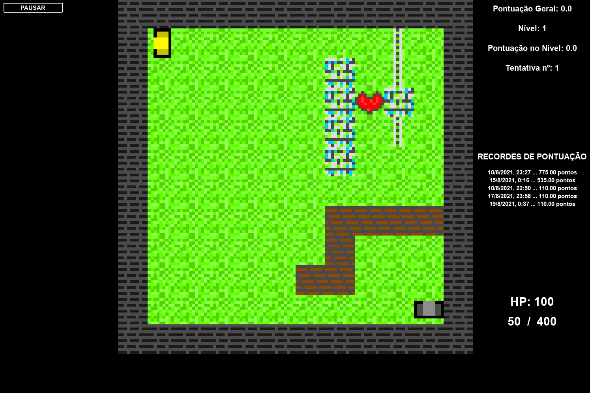

# World War 1.5 :bomb::gun:

* Olá, seja bem vindo ao meu jogo! :video_game:

* Ele é feito para praticar a linguagem Python, utilizando a biblioteca Pygame. :computer:

* Ele é ambientado entre a WWI e a WWII.

* Para jogar, utilize as teclas:

  * W: para ir para frente :arrow_up:
  * S: para ir para trás :arrow_down:
  * A: para ir para esquerda :arrow_left:
  * D: para ir para direita :arrow_right:
  * clique: para atirar :boom:
  * Esc: para pausar :pause_button:

* Seu objetivo é passar todos os 10 níveis, havendo muitos inimigos no caminho.

* Para instalar o jogo, vá em sua linha de comando, se direcione à pasta de sua preferência e digite:

  ```shell
  git clone https://github.com/DoglasRocha/WW_1.5_game.git

* Também é necessário instalar o Python em sua máquina, de preferência da versão 3.8.10 para frente.

* Além disso, é necessário instalar o Pygame, que pode ser feito digitando:

  ```shell
  pip install -r requirements.txt
  ```

* Depois, caso esteja em um Linux, digite para jogar o jogo:

  ```shell
  ./run_game.sh
  ```
  
* Caso esteja em um Windows, digite:

  ```powershell
  python files/main.py
  ```

* E pronto, você já poderá jogar o WW 1.5 Game!

* Futuras atualizações podem acontecer!

* Imagem do jogo:

  

> Divirta-se! :)
